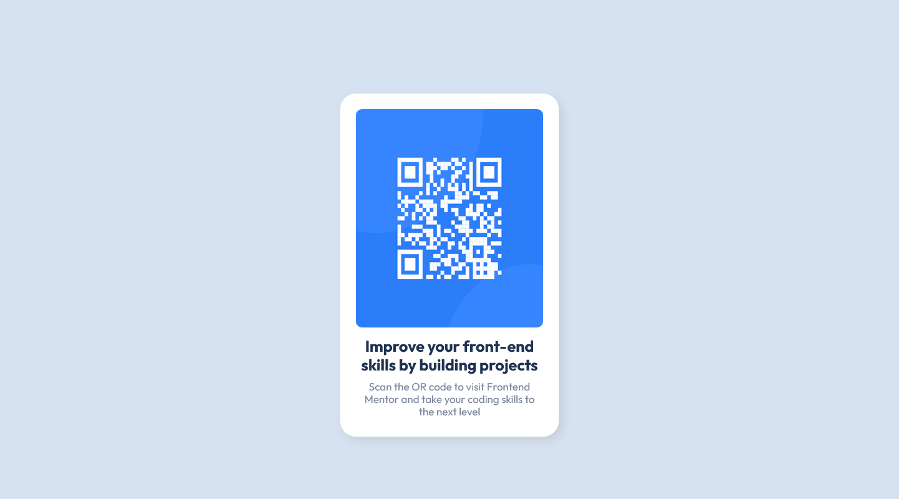
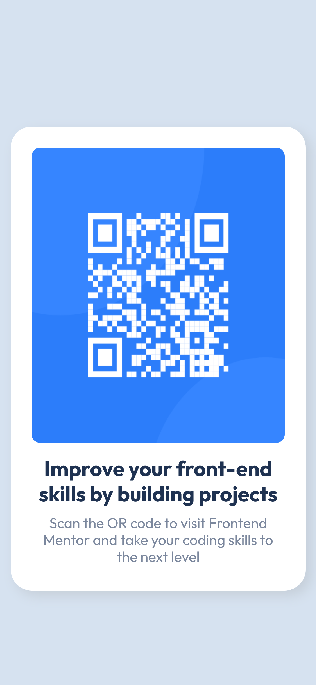

# Frontend Mentor - QR code Component

This is a solution to the [QR code component challenge from Frontend Mentor](https://www.frontendmentor.io/challenges/qr-code-component-iux_sIO_H). Frontend Mentor challenges helped me to improve my coding skills by building realistic projects. 

## Table of contents

- [Overview](#overview)
- [Screenshot](#screenshot)
- [Links](#links)
- [Built with](#built-with)
- [Learning Objectives](#learning-objectives)
- [Continued development](#continued-development)

## Overview

### The Challenge

In this challenge, we are tasked with building a QR code component that matches the design provided. My component should:

- **Display a QR code:** The QR code image should be centered within a card.
- **Include a title and description:** The card should also include a heading and a brief paragraph of text below the QR code.
- **Follow the design closely:** Ensure my solution matches the design specifications in terms of layout, typography, colors, and spacing.

### Design

- **Files provided:** We will be provided with design files in JPEG or PNG format. We have to use these as a reference to replicate the design as closely as possible.
- **Responsive design:** The design should be fully responsive and look good on a variety of screen sizes.

### Requirements from the Frontend Mentor Challenge section

- **Technologies:** Use HTML and CSS to build your solution. You can use any additional libraries or frameworks if desired, but ensure the final product is as close to the design as possible.
- **Best practices:** Write clean, maintainable code following best practices for HTML and CSS.
- **Accessibility:** Consider accessibility in your design, ensuring that the component is usable by people with disabilities.

### Screenshot

Above screenshot is the desktop view. The screenshot below is the mobile-view.

### Links

- Live Site URL: [Add live site URL here](https://your-live-site-url.com)

### Built with

- Semantic HTML5 markup
- CSS custom properties
- Flexbox
- Desktop-first workflow

### Learning Objectives

By completing this challenge, I will:

- Practice building a small component from scratch.
- Improve your HTML and CSS skills.
- Learn how to replicate a design with precision.
- Understand the importance of responsiveness and accessibility.

### Continued development

After completing this challenge, I considered extending my project to further enhance my skills:

- **Enhance accessibility:** Use ARIA roles and properties to improve the accessibility of your component.
- **Experiment with CSS preprocessor and CSS library:** Rebuild the component using SASS and Bootstrap.
- **Optimize performance:** Look into ways to optimize the loading performance of my component, such as lazy-loading images or minifying CSS.

